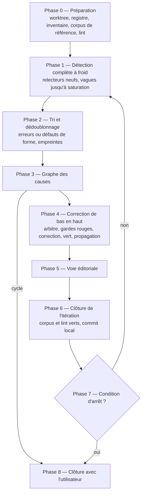

# Fonctionnement

Ce document décrit le protocole que suit le skill. La référence normative reste [`skills/spec-audit/SKILL.md`](../skills/spec-audit/SKILL.md).

## Erreurs et défauts de forme

Une **erreur** est un défaut du contenu propre au domaine du document (logique, mathématique, algorithmique, théorique) :

- un énoncé faux (un contre-exemple existe) ;
- une preuve invalide ou lacunaire ;
- un cadrage insuffisant : hypothèse manquante, domaine d'application non restreint, cas limite non traité ;
- une définition incohérente, mal fondée, ou ambiguë au point de changer un résultat ;
- un algorithme qui ne réalise pas sa spécification, une terminaison non garantie, une complexité fausse ;
- deux résultats qui se contredisent, ou un résumé, une introduction ou une conclusion qui affirment plus que le corps ne démontre ;
- une formule ou un exemple calculé faux, même par faute de frappe.

Seules les erreurs suivent le protocole complet. Les **défauts de forme** (typo hors formule, numérotation, renvoi, bibliographie) suivent une voie éditoriale plus légère. Les préférences de style sont écartées.

## Rôles

| Rôle | Qui | Voit | Écrit |
|---|---|---|---|
| Orchestrateur | la session principale, guidée par le skill | tout : registre, corpus, historique git | document, corpus, registre |
| Relecteur | agent `spec-reviewer`, neuf à chaque vague | le document et ses dépendances normatives, rien d'autre | rien, hors son brouillon |
| Arbitre | agent `spec-adjudicator`, neuf pour chaque erreur | une erreur et le document | rien, hors son brouillon |

L'isolation est le cœur du dispositif :

- le relecteur reçoit un message fixe qui ne dit rien de l'audit : ni registre, ni corpus, ni erreurs précédentes, ni zones corrigées. Attirer son attention sur un passage, ce serait déjà biaiser sa lecture ;
- l'arbitre reçoit l'erreur seule, sans l'identité du relecteur ni les autres erreurs, et juge le texte tel qu'il est maintenant ;
- l'orchestrateur n'arbitre jamais lui-même : il serait juge de son propre travail ;
- aucun agent n'est lancé en « fork », qui hériterait de la conversation et donc de l'historique.

## Vue d'ensemble



## Phase 0 — Préparation

Lecture des règles du projet, choix de la convention de version, création du worktree `audit/<slug>`, création du **registre** (la mémoire de l'audit, mis à jour après chaque étape pour survivre à une compaction du contexte) et de l'**inventaire** (chaque définition et résultat, avec ses dépendances). Le corpus existant est exécuté : il doit être vert, et une garde déjà rouge devient une erreur de l'itération 0. Un script de **lint** déterministe est écrit une fois : numérotation, cibles des renvois, clés bibliographiques, délimiteurs mathématiques, symboles employés avant leur définition.

## Phase 1 — Détection complète, à froid

Toutes les erreurs d'une itération sont détectées avant qu'aucune ne soit traitée : le classement causal n'a de sens que sur l'ensemble. Une première vague réunit un relecteur intégral et, pour un document long ou dense, des relecteurs par angle (logique et preuves ; définitions, cadrage et cas limites ; algorithmes et complexité). Chaque vague suivante est un relecteur intégral neuf ; la détection est saturée quand une vague n'apporte plus rien, et s'arrête au plus tard à la troisième. Le document n'est pas modifié pendant la détection.

## Phase 2 — Tri et dédoublonnage

Chaque constat est orienté (erreur ou défaut de forme) puis résumé par une **empreinte** indépendante de la numérotation : `[type] objet — défaut — témoin`. Elle est comparée, sur le sens, aux autres constats et au registre :

| Comparaison | Suite |
|---|---|
| nouvelle | DÉTECTÉE, vers le graphe des causes |
| identique à une erreur CORRIGÉE | récidive : arrêt, sans recorriger |
| identique à une erreur RÉFUTÉE | écartée ; relevée deux fois, elle révèle une ambiguïté à clarifier sans changer le sens |
| identique à une erreur INDÉCISE ou ESCALADÉE | écartée, déjà en attente |
| même classe, autre instance | nouvelle, liée à l'erreur d'origine |

## Phase 3 — Graphe des causes

Un arc `A → B` signifie « A cause B » : le défaut de B disparaîtrait si A était juste, ou le contre-exemple de B dérive de celui de A, ou le même cadrage manquant se propage de A à B. Une simple dépendance n'est pas une causalité. Chaque arc est justifié au registre ; un lien douteux n'est pas tracé, mais l'ordre des dépendances de l'inventaire fait de toute façon passer la conséquence présumée après sa cause.

Un **cycle** arrête l'audit : il n'y a pas de bas par où commencer. Soit le document raisonne en cercle, soit l'analyse causale est fausse ; dans les deux cas la décision revient à un humain. Le contrôle est refait chaque fois que le graphe change.

## Phase 4 — Correction de bas en haut

```text
tant qu'il reste une erreur ouverte dans le graphe :
    racines = erreurs ouvertes dont toutes les causes sont CORRIGÉES, RÉFUTÉES ou RÉSOLUES
    pour chaque racine, dans l'ordre des dépendances :
        confirmation → gardes (rouge) → correction (vert) → propagation
    pour chaque conséquence dont toutes les causes sont traitées :
        réévaluation
    contrôle de cycle
```

Tant que sa cause n'est pas corrigée, une conséquence est BLOQUÉE : son analyse porterait sur un texte qui va changer, et sa correction risquerait de compenser la cause au lieu de la réparer.

### Confirmation

Un arbitre neuf cherche d'abord à **réfuter** l'erreur (définition mal lue, hypothèse posée ailleurs, contre-exemple inadmissible), puis à la **confirmer** par un contre-exemple minimal exécuté. Un « énoncé faux » sans contre-exemple exécuté redescend en preuve lacunaire ou en INDÉCISE. Si l'arbitre nomme une cause en amont, la racine n'en était pas une : la cause entre dans le graphe et la racine repasse derrière elle.

### Gardes, avant la correction

Écrite après la correction, une garde tend à tester la correction plutôt que l'erreur. Pour chaque erreur confirmée :

| Garde | Rôle |
|---|---|
| témoin | encode l'énoncé original, vérifie qu'il échoue sur le contre-exemple, puis que l'énoncé corrigé y tient |
| variantes | au moins deux cas limites de plus : vide, singleton, 0 et 1, ex aequo, doublons, extrêmes, NULL, ordre non total, débordement |
| quasi-cas | une instance où l'énoncé original est vrai, contre la sur-correction |
| vérification bornée | l'énoncé corrigé, exhaustivement sur un petit domaine ou par propriétés à graine fixe |
| garde de classe | chaque énoncé de l'inventaire exposé au même motif, même s'il est juste aujourd'hui |
| étape de preuve | pour une preuve lacunaire, l'affirmation intermédiaire testée sous les hypothèses disponibles |

La garde est exécutée contre la formulation originale et doit échouer : c'est la preuve qu'elle détecte l'erreur (**rouge d'abord**). Le corpus ne fait que grandir ; aucune garde n'est supprimée ou assouplie pour passer ; l'arithmétique est exacte (entiers, rationnels, calcul symbolique, jamais d'égalité entre flottants) ; le modèle encodé suit les définitions du document, pas la correction proposée.

### Correction

| Nature | Quand |
|---|---|
| correctif d'énoncé | la conclusion est affaiblie ou rectifiée |
| complément de cadrage | une hypothèse est ajoutée, ou le domaine d'application restreint |
| complément ou réparation de preuve | l'énoncé tient, l'étape fautive est justifiée ou remplacée |

La correction est **minimale** : le changement le plus faible qui rend l'énoncé vrai et garde ses usages valides. Elle ne renforce jamais un énoncé, n'introduit pas de résultat nouveau pour boucher un trou et ne supprime jamais un résultat en silence. Les **corrections critiques** (énoncé d'un résultat principal, résultat retiré) attendent l'accord de l'utilisateur, sauf avec `--auto`. Après correction, la garde puis tout le corpus sont exécutés : une garde verte qui passe au rouge est une régression, la correction est annulée et l'erreur repasse en INDÉCISE.

### Propagation et réévaluation

Tout ce qui dépend de l'énoncé corrigé est revérifié : résultats ultérieurs, preuves, exemples, tableaux, résumé, introduction, conclusion, autres documents, code. Un complément de cadrage oblige chaque usage à satisfaire la nouvelle hypothèse ; un usage qui ne la satisfait plus devient une nouvelle erreur, conséquence de la racine. Quand toutes ses causes sont traitées, une conséquence repart chez un arbitre neuf : réfutée, elle est RÉSOLUE et son cas rejoint les gardes de la cause ; confirmée, elle devient une racine.

## Phase 5 — Voie éditoriale

Après les corrections de fond, qui déplacent le texte et les numéros : lint relancé et corrigé, typos hors formules, numérotation stable de préférence (insertion en 4.3′ ou 4.3a, sinon correspondance ancien → nouveau consignée), bibliographie corrigée seulement contre sa source et jamais inventée. Chaque classe de défaut corrigée ajoute une règle au lint. Toute modification d'une formule, d'un symbole, d'un indice, d'un quantificateur ou d'une inégalité est une erreur, pas un défaut de forme.

## Phase 6 — Clôture de l'itération

Corpus et lint doivent être verts. Commit local dans le worktree, listant les identifiants traités, sans push.

## Phase 7 — Conditions d'arrêt

L'audit reprend en phase 1 avec de nouveaux agents, et s'arrête à la première condition remplie :

| Condition | Définition |
|---|---|
| Convergence | une détection complète à froid ne produit aucune erreur confirmée ; si l'itération précédente a modifié un énoncé ou un cadrage, une seconde détection propre est exigée |
| Boucle causale | le graphe des causes contient un cycle |
| Récidive | une erreur est identique à une erreur déjà CORRIGÉE |
| Oscillation | une correction annulerait une correction antérieure, ou une même correction a engendré deux erreurs confirmées successives |
| Non-convergence | le nombre d'erreurs confirmées ne diminue pas sur deux itérations consécutives |
| Budget | `--max-iter` atteint |
| Épuisement | la détection ne relève plus que des défauts de forme |

## Phase 8 — Clôture

L'issue est classée (succès, partiel à poursuivre, partiel à arbitrer, échec), le rapport présenté, puis une question à choix multiple est posée, l'option la plus sûre en premier. Le rapport est rapatrié dans la session et dans la branche d'origine avant toute suppression. Détails : [utilisation](utilisation.md#clôture).

## Ce que l'audit garantit, et ce qu'il ne garantit pas

L'audit garantit que chaque correction répond à une erreur confirmée par un arbitre indépendant, qu'elle est la plus faible possible, et qu'une garde vue rouge avant elle la protège. Il ne garantit pas l'absence d'erreur : une relecture par des agents et des tests bornés ne sont ni une relecture par les pairs ni une preuve. Le rapport le dit explicitement, en séparant ce qui a été vérifié, et comment, de ce qui ne l'a pas été.
