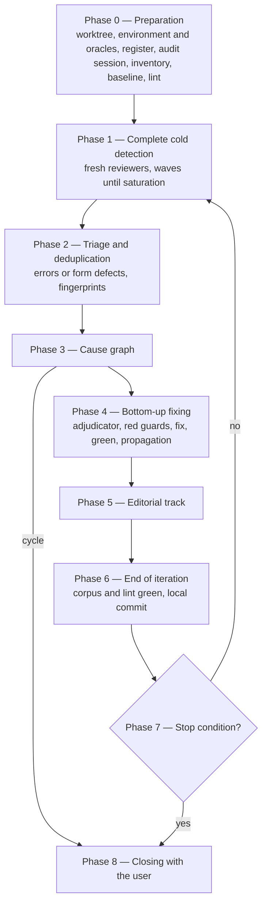

# How it works

This document describes the protocol the skill follows. The normative reference remains [`skills/start/SKILL.md`](../skills/start/SKILL.md).

## Errors and form defects

An **error** is a defect in the content specific to the document's domain (logical, mathematical, algorithmic, theoretical):

- a false statement (a counterexample exists);
- an invalid or incomplete proof;
- insufficient scoping: missing hypothesis, domain of application not restricted, edge case not handled;
- a definition that is inconsistent, ill-founded, or ambiguous enough to change a result;
- an algorithm that does not meet its specification, termination not guaranteed, a wrong complexity;
- two results that contradict each other, or an abstract, introduction or conclusion that claims more than the body proves;
- a wrong formula or computed example, even from a typo.

Only errors follow the full protocol. **Form defects** (typo outside formulas, numbering, cross-reference, bibliography) follow a lighter editorial track. Style preferences are discarded.

## Roles

| Role | Who | Sees | Writes |
|---|---|---|---|
| Launcher | your session, guided by the skill | your session, the original repository, the register | worktree and register (preparation), stop, closing |
| Orchestrator | the audit session, a `claude -p` process launched in the worktree, or your session with `--in-session` | everything in the worktree: register, corpus, oracles, git history | document, corpus, register |
| Reviewer | `spec-reviewer` agent, fresh for each wave | the document and its normative dependencies, nothing else | nothing, outside its scratch directory |
| Adjudicator | `spec-adjudicator` agent, fresh for each error | one error and the document | nothing, outside its scratch directory |

Isolation is at the heart of the design:

- the reviewer receives a fixed message that says nothing about the audit: no register, no corpus, no previous errors, no fixed areas. Drawing its attention to a passage would already bias its reading;
- the adjudicator receives the error alone, without the reviewer's identity or the other errors, and judges the text as it is now;
- the orchestrator never adjudicates: it would be judging its own work;
- no agent is launched as a "fork", which would inherit the conversation and therefore the history;
- no agent reads a session-history folder (tokenforge's `.forge/`, transcripts, handoffs); one that git tracks is untracked before the worktree is created, if the user agrees;
- the audit runs in a session of its own, with no settings, plugin, skill, connector, hook, memory or conversation of the launcher's, and a Bash allow list that is exactly git and the project's oracles: what it could run is what the register says it ran.

## Overview



## Phase 0 — Preparation

Reading the project's rules, choosing the version convention, creating the `audit/<slug>` worktree, establishing the **environment** and creating the **register** (the audit's memory, updated after each step so that it survives a context compaction), then launching the **audit session** unless `--in-session` is given. The environment is what the audit may use, and nothing else: the resources of the launcher's session (plugins, skills, connectors, hooks) are inventoried and ignored; the project's **oracles**, every artifact that can decide statements of the document (a mechanized development, a reference model or checker, a test runner), are found, run once in the worktree and recorded by strength with their coverage and their command; and the worktree is made autonomous, by sharing third-party caches through a link, copying unversioned inputs with their SHA-256, and rebuilding the project's own build outputs, so that the baseline is probative. In the worktree, the orchestrator then builds the **inventory** (every definition and result, with its dependencies). The existing corpus is run with the oracles' commands, from the worktree alone: it must be green, and a guard that is already red becomes an iteration-0 error. A deterministic **lint** script is written once: numbering, cross-reference targets, bibliography keys, math delimiters, symbols used before their definition.

## Phase 1 — Complete cold detection

All errors of an iteration are detected before any is handled: causal sorting only makes sense on the full set. A first wave brings together a full reviewer and, for a long or dense document, angle reviewers (logic and proofs; definitions, scoping and edge cases; algorithms and complexity). Each following wave is a fresh full reviewer; detection is saturated when a wave brings nothing new, and stops at the third wave at the latest. The document is not modified during detection.

## Phase 2 — Triage and deduplication

Each finding is classified (error or form defect) then summarized by a **fingerprint** independent of numbering: `[type] object — defect — witness`. It is compared, on meaning, with the other findings and with the register:

| Comparison | Outcome |
|---|---|
| new | DETECTED, on to the cause graph |
| identical to a FIXED error | recurrence: stop, without fixing again |
| identical to a REFUTED error | discarded; raised twice, it reveals an ambiguity to clarify without changing the meaning |
| identical to an UNDECIDED or ESCALATED error | discarded, already pending |
| same class, other instance | new, linked to the original error |

## Phase 3 — Cause graph

An edge `A → B` means "A causes B": B's defect would disappear if A were correct, or B's counterexample derives from A's, or the same missing scoping propagates from A to B. A mere dependency is not a causation: there is no edge when B's own defect would remain even if A were true, and B is then a root. B still uses A, though: if A is confirmed, B also becomes a suspect behind A (see below). Each edge is justified in the register; a doubtful link is not drawn, but the inventory's dependency order makes the presumed consequence come after its cause anyway.

A **cycle** stops the audit: there is no bottom to start from. Either the document reasons in a circle, or the causal analysis is wrong; in both cases the decision belongs to a human. The check is redone every time the graph changes.

## Phase 4 — Bottom-up fixing

```text
while an open error remains in the graph:
    roots = open errors all of whose causes are FIXED, REFUTED or RESOLVED
    for each root, in dependency order:
        confirmation (+ suspects) → guards (red) → fix (green) → propagation
    for each consequence all of whose causes are handled, suspects included:
        reassessment
    cycle check
```

As long as its cause is not fixed, a consequence, suspect or not, is BLOCKED: its analysis would bear on a text that is about to change, and its fix would risk compensating for the cause instead of repairing it.

### Confirmation

A fresh adjudicator first tries to **refute** the error (misread definition, hypothesis stated elsewhere, inadmissible counterexample), then to **confirm** it with a minimal executed counterexample. A "false statement" without an executed counterexample is downgraded to incomplete proof or UNDECIDED. If the adjudicator names an upstream cause, the root was not one: the cause enters the graph and the root goes back behind it.

The counterexample runs on the strongest **oracle** of the register's table that covers the statement, and the verdict says which level it reached:

| Level | Oracle | Counterexample |
|---|---|---|
| formal | the project's mechanized development, through the document's correspondence table | on the formal counterpart of the statement: `#eval`, `decide`, a property-based search, or a theorem refuting it on the witness; a script that re-encodes the statement does not reach this level |
| model | a reference model or checker of the project | run on the model |
| ad hoc | none covers the statement | the adjudicator's own script, in exact arithmetic |

A statement of the formal level confirmed only ad hoc stays UNDECIDED: the encoding, not the text, would be judged. The report counts confirmations by level.

### Suspects

A result C that uses A is correct if A is granted, so no reviewer flags it. Yet once A is confirmed false, nobody knows whether C holds until A is fixed, and a conditional result must never leave the audit presented as safe. So as soon as A is confirmed, every result or passage that uses A directly (found in the inventory and in the adjudicator's `impact` field) becomes a **suspect**: it enters the graph as a consequence of A, with the edge justified by "uses F-…, confirmed false as stated", BLOCKED behind A, even if it is correct granting A. A result that is already a root for its own defect gets a suspect entry too. When a consequence is confirmed in turn, its own uses become suspects: propagation is transitive, but only along confirmed links.

A suspect is settled only once its cause is fixed. If the cause stays unfixed (undecided, critical fix refused or pending, fix reverted after a regression), its suspects stay BLOCKED, and the report lists them as results conditional on an unresolved error, never as correct results.

An undecided error creates no suspects: nothing in the text changes, so there is nothing to reassess. Instead, the final report computes from the inventory every result that depends on an unresolved error, directly or through another result, and lists them as conditional. This closure also covers the results that depend on a suspect, which suspects alone do not reach.

### Guards, before the fix

Written after the fix, a guard tends to test the fix rather than the error. For each confirmed error:

| Guard | Role |
|---|---|
| witness | encodes the original statement, checks that it fails on the counterexample, then that the fixed statement holds on it |
| variants | at least two more edge cases: empty, singleton, 0 and 1, ties, duplicates, extremes, NULL, non-total order, overflow |
| near-case | an instance where the original statement is true, against over-correction |
| bounded check | the fixed statement, exhaustively on a small domain or property-based with a fixed seed |
| class guard | each statement of the inventory exposed to the same pattern, even if it is correct today |
| proof step | for an incomplete proof, the intermediate claim tested under the hypotheses available |

The guard is run against the original wording and must fail: that is the proof that it detects the error (**red first**). The corpus only grows; no guard is deleted or loosened to pass; arithmetic is exact (integers, rationals, symbolic computation, never equality between floats); the encoded model follows the document's definitions, not the proposed fix.

A guard is written for the oracle that confirmed the error, at its level: for a formal oracle, a theorem or a decided check in a module that the project's build compiles, so that replaying the corpus is the build; for a model, a test that runs the model; otherwise a test of the runner. A decision procedure that extends the trusted base (`native_decide`) may serve the search, never the recorded guard.

### Fix

| Nature | When |
|---|---|
| statement fix | the conclusion is weakened or corrected |
| scoping addition | a hypothesis is added, or the domain of application restricted |
| proof completion or repair | the statement holds, the faulty step is justified or replaced |

The fix is **minimal**: the weakest change that makes the statement true and keeps its uses valid. It never strengthens a statement, does not introduce a new result to plug a gap, and never deletes a result silently. **Critical fixes** (statement of a main result, withdrawn result) wait for the user's approval, except with `--auto`. After the fix, the guard and then the whole corpus are run: a green guard that turns red is a regression, the fix is reverted and the error goes back to UNDECIDED.

When the fixed statement has a formal counterpart, the fix includes the change of the formal statement and of its proof, and the update of the correspondence table, in the same internal revision; without them the error stays an incomplete proof, never FIXED.

Each fixed error is then committed in the worktree as an **internal revision**, marked incomplete: a verified state, every guard green, to which a stop can return. It is incomplete because the consequences of the error may not have been reassessed yet. The mark stays in the commit message and the register, never in the document: the reviewers read the document and must not learn that an audit is running.

### Propagation and reassessment

Everything that depends on the fixed statement is rechecked, including the uses without an edge: later results, proofs, examples, tables, abstract, introduction, conclusion, other documents, code. What each use must still get from the fixed statement depends on the nature of the fix:

| Nature of the fix | Uses |
|---|---|
| statement fix | every use that relied on the original conclusion becomes a new error, unless the fixed conclusion still gives it what it needs |
| scoping addition | every use must satisfy the new hypothesis; a use that no longer does becomes a new error |
| proof completion or repair | not affected: the statement is unchanged |

New errors are consequences of the root; uses already in the graph as suspects are left to their reassessment. Once all its causes are handled, a consequence or a suspect goes back to a fresh adjudicator, who judges it against the fixed text; one adjudicator can handle all the suspects of the same cause, with one verdict each. Refuted, it is RESOLVED and its case joins the cause's guards; confirmed, it becomes a root and its own uses become suspects. The suspects of an incomplete proof repaired without changing its statement are RESOLVED without adjudication: nothing they use has changed.

## Phase 5 — Editorial track

After the substantive fixes, which move the text and the numbers: lint rerun and fixed, typos outside formulas, stable numbering preferred (insertion as 4.3′ or 4.3a, otherwise an old → new mapping is recorded), bibliography fixed only against its source and never invented. Each class of defect fixed adds a rule to the lint. Any change to a formula, symbol, index, quantifier or inequality is an error, not a form defect.

## Phase 6 — End of iteration

Corpus and lint must be green. Local commit in the worktree, listing the identifiers handled, without pushing.

## Phase 7 — Stop conditions

The audit goes back to phase 1 with new agents, and stops at the first condition met:

| Condition | Definition |
|---|---|
| Convergence | a complete cold detection produces no confirmed error; if the previous iteration changed a statement or a scoping, a second clean detection is required |
| Causal loop | the cause graph contains a cycle |
| Recurrence | an error is identical to an already FIXED error |
| Oscillation | a fix would undo an earlier fix, or the same fix has produced two successive confirmed errors |
| Non-convergence | the number of confirmed errors does not decrease over two consecutive iterations |
| Budget | `--max-iter` reached |
| Exhaustion | detection only finds form defects |

## Phase 8 — Closing

The outcome is classified (success, partial to continue, partial needing a decision, failure), the report is presented, then a multiple-choice question is asked, with the safest option first. The report is brought back to the session and to the original branch before any removal. Details: [usage](usage.md#closing).

The audit can also be stopped at any time, from the session that launched it only (its register records the session id): the audit session's process is stopped, which ends its agents (with `--in-session`, the agents are stopped), the last internal revision is reported, marked incomplete, and the user chooses to suspend the audit, keep that revision as the new base, or cancel. Details: [usage](usage.md#stopping-an-audit).

Claude Code cannot pause an agent, so the audit is made safe to interrupt in two ways. Questions to the user wait until no agent is running, since a question blocks the orchestrator but not the agents. And every agent is replaceable: it keeps a `progress.md` with its scripts and outputs in its scratch directory, the register lists every agent with its state, and an interrupted agent is never resumed but replaced, at resume, by a fresh one given the same message and scratch directory. The replacement reuses the computations and redoes the judgment on the current text; a reviewer never takes over another agent's judgment, so the review stays cold.

## What the audit guarantees, and what it does not

The audit guarantees that each fix answers an error confirmed by an independent adjudicator, that it is the weakest possible, and that a guard seen red before it protects it. It does not guarantee the absence of errors: review by agents and bounded tests are neither peer review nor proof. The report says so explicitly, separating what was checked, and how, from what was not.
